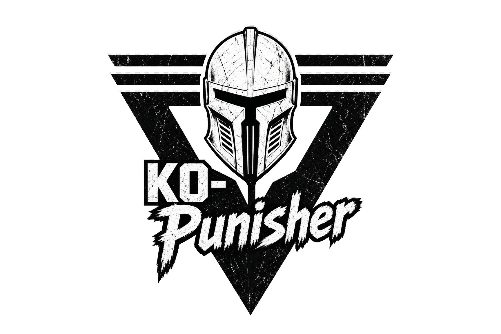

<p align="center">
  
</p>

<h1 align="center">KO-Punisher</h1>
<p align="center">Knight Online için Windows masaüstü combo, skill bar ve OCR araçları.</p>
<p align="center"><strong>C# · .NET 8 · WinForms · Windows x64</strong></p>

KO-Punisher ile job bazında combo ve tuş düzeni oluşturabilir, skill ikonlarını sürükleyerek barlara yerleştirebilir ve yerleşime göre tuş atamalarını otomatik eşleştirebilirsiniz. Proje ayrıca bağımsız Minor kontrolü, görsel skill kalibrasyonu ve envanter tooltip okuma araçları içerir.

> **Durum:** Geliştirme aşamasında. Derleme ve otomatik testler, oyunun gönderilen tuşları kabul ettiğini veya OCR'ın her ekranda doğru çalıştığını kanıtlamaz. Kullandığınız sunucunun otomasyon kurallarını kontrol edin.

[Kurulum](#kurulum) · [İlk kullanım](#ilk-kullanım) · [Skill Bar](#skill-bar-ve-otomatik-kalibrasyon) · [Testler](#testler) · [Dokümantasyon](#dokümantasyon)

## Özellikler

| Alan | Mevcut işlevler |
|---|---|
| **Job ve profiller** | Ana menü sırası: Warrior, Assassin, Archery, Mage, Priest, Farm, Upgrade, Ayarlar. BP ayrı menü değil, Priest > Attack içinde `bp-rr` modu olarak saklanır |
| **Skill Bar** | F1–F8, bar başına 10 slot; sağdaki ikon havuzundan sürükle-bırak, arama ve kategori filtresi |
| **Otomatik tuş eşleştirme** | Skill kimliğinden bar ve tuş çözümleme; farklı F barlarındaki skilleri çağırma |
| **Görsel kalibrasyon** | Ekrandan seçilen tek barı katalog ikonlarıyla eşleştirme ve onaylı içe aktarma |
| **Combo, Minor ve pot** | Job bazlı presetler, ayarlanabilir zamanlamalar, bağımsız Minor döngüsü, tek tur testi, kalibre edilen HP/MP bölgelerinden otomatik pot |
| **Farm araçları** | Buff zamanlayıcı, OCR hedef adı filtresi ve sınırlı sayıda pazar mesajı gönderimi |
| **Envanter inceleme** | Slot sınıflandırma, tooltip OCR ve okunabilen item bilgilerinin incelenmesi |
| **Kontrol ve tanılama** | Hedef pencere odağı kontrolü, acil durdurma, tuş bırakma ve Ayarlar altında isteğe bağlı input tanılama kaydı |

Uygulama Windows giriş API'lerini kullanır. Oyun belleği okuma, oyun içine enjeksiyon, kernel driver veya koruma atlatma içermez.

## Kurulum

### Gereksinimler

- Windows 10 **2004 / build 19041** veya üzeri, x64.
- Kaynaktan derlemek için [.NET 8 SDK](https://dotnet.microsoft.com/download/dotnet/8.0).
- İlk derlemede NuGet bağımlılıklarını indirmek için internet bağlantısı.

Bu depo kaynak kodu içerir; derlenmiş `.exe` ve `bin/obj` klasörlerini takip etmez.

### Kaynaktan derleme

```powershell
git clone https://github.com/frknaykc/KO-Punisher.git
cd KO-Punisher
dotnet build KO-Punisher/KO-Punisher.csproj -c Release -warnaserror
```

Windows üzerinde uygulamayı açın:

```powershell
.\KO-Punisher\bin\Release\KO-Punisher.exe
```

Normal derleme çıktısı kurulu .NET 8 Windows Desktop Runtime kullanır. EXE'yi yanındaki dosyalardan ayırmayın.

### Taşınabilir Windows paketi

.NET çalışma zamanını da içeren bir klasör oluşturmak için:

```powershell
dotnet publish KO-Punisher/KO-Punisher.csproj -c Release -r win-x64 --self-contained true -p:PublishSingleFile=false -warnaserror -o publish
```

`publish/KO-Punisher.exe` dosyasını çalıştırın. Başka cihaza aktarırken **publish klasörünün tamamını** taşıyın; DLL'ler, `images/`, `tessdata/` ve varsayılan ayarlar gereklidir.

### macOS / Linux üzerinde geliştirme

WinForms arayüzü yalnız Windows'ta çalışır. Diğer platformlarda çekirdek testlerini çalıştırabilir ve Windows hedefini çapraz derleyebilirsiniz:

```sh
dotnet build KO-Punisher/KO-Punisher.csproj -c Release -warnaserror -p:EnableWindowsTargeting=true
dotnet run --project Tests/Tests.csproj -c Release
```

## İlk kullanım

1. Job'unuzu ve combo presetini seçin.
2. **Skill Bar** sekmesinde oyundaki bar düzeninizi oluşturun. Katalogdan ikon sürükleyin veya görsel kalibrasyonu kullanın.
3. Combo ve Minor tetiklerini kontrol edin. Varsayılan tetikler `XBUTTON1` ve `XBUTTON2`; Minor ataması başlangıçta boştur. Battle Priest için Priest sayfasında `bp-rr` presetini seçin.
4. **Diğer** sekmesinde otomatik HP/MP pot gerekiyorsa ayrı ayrı açın; yüzde eşiği, fallback tuş, cooldown/okuma aralığı ve HP/MP ekran bölgesini kalibre edin. Okunamayan OCR değeri sıfır sayılmaz ve tuş göndermez.
5. **Kaydet** ile ayarlarınızı saklayın. Kullanıcı ayarları `%LOCALAPPDATA%\KO-Punisher\settings.json` altında tutulur.
6. İlk denemede **3 sn sonra tek tur** seçeneğiyle oyuna geçin ve tuş sırasını kontrol edin.
7. **Başlat / Hazırla** sonrası, varsayılan basılı-tut modunda combo tetiğini basılı tutarak çalıştırın; bırakarak ilgili döngüyü durdurun.

Varsayılan acil durdurma tuşu **F12**'dir. Hedef pencere odağı kaybolunca motor basılı tuşları bırakır; geri dönünce yeniden tetik gerekir. Skill bar adresleriyle çakışan kontrol kısayollarını değiştirin.

## Skill Bar ve otomatik kalibrasyon

Her slot, görselin yanında kalıcı bir **skill kimliği** taşır. Motor tuşları bu kimliğin yerleşimine göre çözer.

Örneğin F1 barında:

| Skill | Slot | `3-5` sırası | `5-3` sırası |
|---|---:|---:|---:|
| Multiple Shot | 6 | 1. | 2. |
| Arrow Shower | 5 | 2. | 1. |

Bu düzende `3-5` **6 → 5**, `5-3` **5 → 6** gönderir. Slide presetleri aralara hareket tuşunu ekler. Skill başka bir F barındaysa motor bar geçişini de yapar.

**OCR ile kalibre et** düğmesi skill adını metinden okumak yerine **ikon şablonlarını eşleştirir**:

1. Editörde ve oyunda aynı F barını açın.
2. Yatay veya dikey 10 slotu, `1–0` aralığını kapsayacak şekilde seçin.
3. Sonuçları inceleyip onaylayın. Editör ekran kırpımını değil, katalogdaki skill sembollerini kullanır.
4. Tanınmayan slotları elle doldurup yerleşimi kaydedin.

Belirsiz eşleşmeler boş kalır. İptal veya sıfır eşleşme önceki yerleşimi değiştirmez. Ayrıntılar: [Skill Bar ve kalibrasyon](docs/skill-bar-calibration.md).

Eski bağımsız OCR combo-test sayfası, ona ait butonlar ve kullanılmayan ekran kodları kaldırıldı. Tekrarlanan eski skill bar editörü de kaldırıldı; tek düzenleme kaynağı **Skill Bar** sekmesidir. OCR yetenekleri Skill Bar kalibrasyonu, Farm hedef adı okuma, Upgrade/envanter okuma ve HP/MP pot bölgeleri için korunur.
`HP Potion` ve `MP Potion` sembolleri yerel, ayırt edilebilir UI/katalog sembolleridir; gerçek oyun pot ikon şablonu olarak doğrulanmadı.

## Testler

Platform bağımsız test düzeneği:

```sh
dotnet run --project Tests/Tests.csproj -c Release
```

Yalnız kalibrasyon ve ikon eşleştirme testleri:

```sh
dotnet run --project Tests/Tests.csproj -c Release -- --calibration
```

OCR görüntü ön işleme kontrolleri:

```sh
dotnet run --project Tests.Ocr.Windows/Pure/Preprocessing.csproj -c Release
```

Testler; combo sırası, bar adresleme, profil ayrımı, iptal/odak kaybı, ikon belirsizliği ve kayıtlı görüntü örneklerini kapsar. `Tests.Windows`, `Tests.Ocr.Windows` ve `Tests.Inventory.Live` Windows'a özgü ek test araçlarıdır. Canlı input veya ekran taraması testlerini etkileşimli Windows oturumunda, ilgili aracın seçeneklerini inceleyerek çalıştırın.

[GitHub Actions](https://github.com/frknaykc/KO-Punisher/actions) Windows derlemesini ve platform bağımsız kontrolleri çalıştırır; oyun kabulünü veya canlı GUI davranışını test etmez.

## Bilinen sınırlar

- Skill kataloğu tüm sunucu ve ikon paketlerini kapsamaz. Cooldown kararması, UI ölçeği ve hatalı kırpma tanımayı etkiler.
- Görsel kalibrasyon bir seferde **tek 10 slotlu barı** tarar. Canlı Windows skill taraması ve farklı DPI düzenleri için doğrulama sürüyor.
- `70-72`, `70-60`, `70-72-60` presetleri görsel yerleşimde ilk iki/üç saldırı slotunu kullanır; katalogdan skill seviyesi çıkarmaz. [Eşleştirme kurallarını](docs/skill-bar-calibration.md#combo-eşleştirmesi) kontrol edin.
- Cooldown ve zamanlamalar ayarlanabilir tahminlerdir. Windows'a başarılı tuş gönderimi, oyunda başarılı skill kullanımı anlamına gelmez.
- HP/MP otomatik pot yalnız kalibre edilen ekran bölgelerini OCR ile okur. Yüzde ya da tek bir `current/max` değeri net okunmazsa girdi göndermez; canlı oyun kabulü ayrıca doğrulanmalıdır.
- Envanter/tooltip okuma, otomatik item basma değildir. Anvil, scroll kullanımı ve otomatik upgrade uygulanmadı.
- Exclusive fullscreen ekran yakalama ve durum panelini etkileyebilir. Pencere/borderless modunda deneyin.

## Proje yapısı

```text
KO-Punisher/          WinForms uygulaması, motor, görseller ve OCR modeli
Tests/               Platform bağımsız regresyon testleri ve fixture'lar
Tests.Windows/       Windows arayüz/input testleri
Tests.Ocr.Windows/   Kayıtlı görüntü OCR testleri ve Pure/ ön işleme testleri
Tests.Inventory.Live/ Windows canlı envanter test aracı
docs/                Kullanım, kalibrasyon ve araştırma notları
```

## Dokümantasyon

- [Ayrıntılı kullanım, zamanlamalar ve tanılama](docs/kullanim.md)
- [Skill Bar ve görsel kalibrasyon](docs/skill-bar-calibration.md)
- [Skill kataloğu kaynakları ve kapsamı](docs/skill-catalog-sources.md)
- [Envanter görüntü işleme](docs/inventory-vision.md)
- [Tooltip OCR](docs/tooltip-ocr.md)
- [Katkı rehberi](CONTRIBUTING.md) · [Güvenlik bildirimi](SECURITY.md)

## Haklar ve üçüncü taraf içerikler

Projenin telif sahibi **Furkan “NaxoziwuS” Aykaç**'tır. Bu depoda proje kodu için açık kaynak lisansı tanımlı değildir; depoyu herkese açık görmek tek başına kullanım veya yeniden dağıtım lisansı vermez.

Knight Online adı ve oyun görsellerinin hakları ilgili sahiplerine aittir. KO-Punisher resmî bir Knight Online ürünü değildir. Skill görsellerinin kaynakları [katalog belgesinde](docs/skill-catalog-sources.md), OCR bağımlılıkları ve lisansları [üçüncü taraf notlarında](THIRD_PARTY_NOTICES.md) listelenir. Proje kodunun telif bildirimi bu içeriklerin haklarını kapsamaz.
